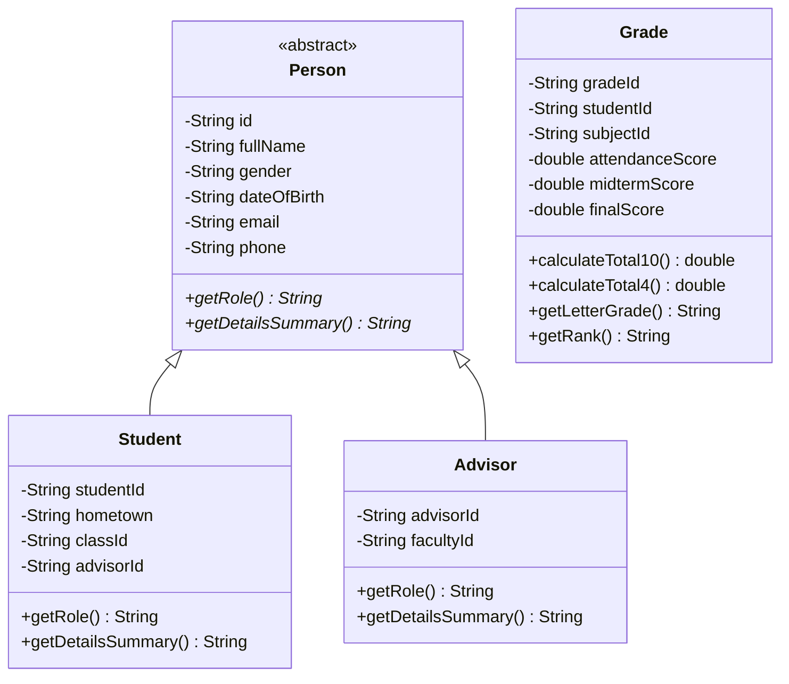

# BÁO CÁO BÀI TẬP LỚN MÔN LẬP TRÌNH HƯỚNG ĐỐI TƯỢNG (JAVA)
## ĐỀ TÀI: PHẦN MỀM QUẢN LÝ SINH VIÊN TOÀN DIỆN (JAVA SWING - CODEMAP STUDIO)

---

## 1. Giới Thiệu Chương Trình
Ứng dụng **Phần Mềm Quản Lý Sinh Viên** được xây dựng bằng ngôn ngữ **Java Desktop (Java Swing)** theo chuẩn cấu trúc bài giảng **CodeMap Studio** và kiến trúc **MVC (Model - View - Controller)** kết hợp với **Service Layer** và **Repository DataStore**.

Phần mềm tích hợp đầy đủ 8 module chức năng từ Đăng nhập/Phân quyền, Đổi mật khẩu, Quản lý Khoa, Quản lý Lớp, Quản lý Cố vấn học tập, Quản lý Môn học, Quản lý Sinh viên đến Quản lý Điểm & Tính GPA tích lũy.

---

## 2. Thể Hiện 4 Nguyên Lý OOP Trong Dự Án

### 2.1. Tính Đóng Gói (Encapsulation)
- Khai báo tất cả trường thuộc tính dạng `private` trong các lớp Model (`User`, `Person`, `Faculty`, `StudentClass`, `Advisor`, `Subject`, `Student`, `Grade`).
- Cung cấp các phương thức `getter` và `setter` chuẩn.
- Kiểm tra tính hợp lệ dữ liệu đầu vào qua `ValidationUtil` (Email, Số điện thoại, Điểm số từ 0.0 đến 10.0, mã không rỗng).

### 2.2. Tính Kế Thừa (Inheritance)
- Lớp trừu tượng `Person`: Định nghĩa thuộc tính nhân thân chung (`id`, `fullName`, `gender`, `dateOfBirth`, `email`, `phone`).
- Lớp `Student` kế thừa `Person`: Thêm `studentId`, `hometown`, `classId`, `advisorId`.
- Lớp `Advisor` kế thừa `Person`: Thêm `advisorId`, `facultyId`.

### 2.3. Tính Đa Hình (Polymorphism)
- Phương thức `getRole()` và `getDetailsSummary()` được nạp chồng/ghi đè (Override) khác nhau ở `Student` và `Advisor`.
- Xử lý bảng điểm `Grade`: Tính điểm tổng kết hệ 10 (`calculateTotal10()`), điểm hệ 4 (`calculateTotal4()`), quy đổi điểm chữ (`A, B, C, D, F`) và xếp loại học lực.

### 2.4. Tính Trừu Tượng (Abstraction)
- Lớp trừu tượng `Person`.
- Hợp đồng xử lý dữ liệu tập trung `DataStore` và các Service Interfaces.

---

## 3. Cấu Trúc Package (MVC Architecture)

```
com.studentmanagement/
├── Main.java                          # Entry point khởi chạy ứng dụng
├── model/                             # [MODEL] Các thực thể dữ liệu
│   ├── User.java                      # Tài khoản & Phân quyền ADMIN/GIANGVIEN (Video #2)
│   ├── Person.java                    # Lớp trừu tượng cơ sở (OOP)
│   ├── Faculty.java                   # Thực thể Khoa (Video #4)
│   ├── StudentClass.java              # Thực thể Lớp học (Video #5)
│   ├── Advisor.java                   # Thực thể Cố vấn học tập (Video #6)
│   ├── Subject.java                   # Thực thể Môn học (Video #7)
│   ├── Student.java                   # Thực thể Sinh viên (Video #8)
│   └── Grade.java                     # Thực thể Bảng điểm (Video #9)
├── exception/                         # Custom Exception handling
│   ├── AppException.java
│   ├── AuthenticationException.java
│   ├── InvalidDataException.java
│   └── DuplicateEntityException.java
├── util/                              # Tiện ích hệ thống
│   ├── ValidationUtil.java            # Validate dữ liệu Regex
│   ├── CsvUtil.java                   # Đọc/ghi CSV persistence
│   └── FileReportUtil.java            # Xuất bảng điểm TXT
├── repository/                        # [REPOSITORY] Quản lý lưu trữ
│   └── DataStore.java                 # Quản lý bộ nhớ & tự động lưu file CSV
├── service/                           # [SERVICE] Xử lý nghiệp vụ
│   ├── AuthService.java               # Đăng nhập & Đổi mật khẩu (Video #2, #3)
│   ├── FacultyService.java            # Nghiệp vụ Khoa (Video #4)
│   ├── ClassService.java              # Nghiệp vụ Lớp (Video #5)
│   ├── AdvisorService.java            # Nghiệp vụ Cố vấn (Video #6)
│   ├── SubjectService.java            # Nghiệp vụ Môn học (Video #7)
│   ├── StudentService.java            # Nghiệp vụ Sinh viên (Video #8)
│   └── GradeService.java              # Nghiệp vụ Điểm & GPA (Video #9)
└── view/                              # [VIEW] Giao diện Swing MVC
    ├── LoginFrame.java                # Màn hình Đăng nhập (Video #2)
    ├── ChangePasswordDialog.java      # Form Đổi mật khẩu (Video #3)
    ├── MainFrame.java                 # Cửa sổ chính tích hợp 6 tab quản lý
    ├── FacultyPanel.java              # Giao diện Quản lý Khoa (Video #4)
    ├── ClassPanel.java                # Giao diện Quản lý Lớp (Video #5)
    ├── AdvisorPanel.java              # Giao diện Quản lý Cố vấn (Video #6)
    ├── SubjectPanel.java              # Giao diện Quản lý Môn học (Video #7)
    ├── StudentPanel.java              # Giao diện Quản lý Sinh viên (Video #8)
    ├── GradePanel.java                # Giao diện Quản lý Điểm (Video #9)
    └── CustomTableModels.java         # JTable Models
```

---

## 4. Class Diagram (Mermaid)



---


